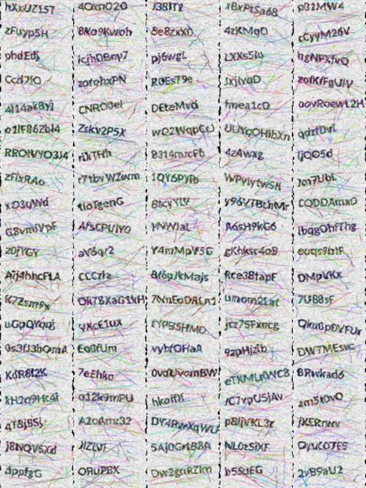
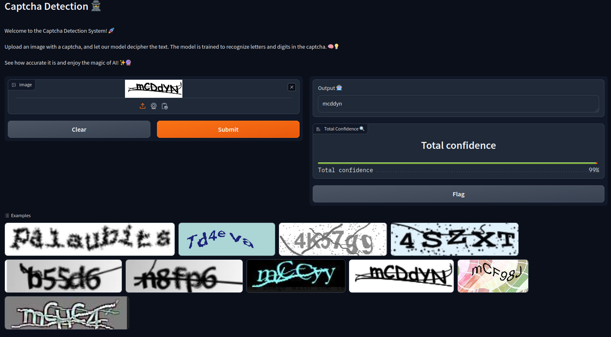

# Captcha Recognition System

## Overview

This project focuses on implementing a captcha recognition system, providing end-to-end functionality from data preprocessing to model training and real-time interface setup. The repository comprises various Python files that collectively form a comprehensive captcha recognition system. The main components include the model architecture, utilities for data loading and training, visualization tools, and additional scripts for accuracy calculation, captcha generation, dataset creation, and interface setup.

## Main Dataset

The primary dataset used for training and testing the captcha recognition models can be obtained from the following link:

[Main Dataset on Hugging Face](https://huggingface.co/datasets/hammer888/captcha-data)

### Notes:

Download all segments of the parquet files and save them in the `data` directory. The `make_dataset` script combines these segments. Subsequently, execute the `captcha_generator` script to generate a custom dataset, enhancing the model's accuracy.

## File Descriptions

### 1. `data_loader.py`

This utility file encompasses functions crucial for data loading and model training:

- `SquarePadAndResize`: A custom image transformation class facilitating image padding and resizing.
- `load_data`: A function to load data, split it into training and testing sets, and create DataLoader instances for efficient training.
- `load_model`: A function for initializing or loading a model, with the option to load weights from the latest saved checkpoint.
- `set_requires_grad`: A function to selectively set the `requires_grad` attribute for model parameters.
- `train_model`: A function orchestrating the model training process, including a pretraining phase for freezing CNN layers.

### 2. `model.py`

This file provides the core model implementations:

#### `CNNModel`:

- A simplified CNN model using EfficientNet for feature extraction.
- Directly outputs probabilities for each class at each time step.

### 3. `accuracy_calculator.py`

This script includes functions for calculating accuracy and Character Error Rate (CER) of the model on a test dataset. It utilizes the loaded model, test dataloader, and various utility functions.

### 4. `captcha_generator.py`

This Python script is designed to generate captcha images with random strings, spots, lines, and apply elastic transformations. The resulting captchas are stored in a Parquet file along with their associated labels.

#### Functions:

- `generate_random_string`: Generates a random alphanumeric string of a specified length.
- `draw_text`: Draws rotated text on an image with a specified font, position, color, and angle.
- `draw_spots`: Draws random spots on an image.
- `draw_lines`: Draws random lines on an image.
- `elastic_transform`: Applies an elastic transformation to an image.
- `generate_captcha`: Generates a captcha image and returns binary bytes, file name, and associated text.
- `generate_captcha_data`: Generates a specified number of captcha images and returns data in a list.
- `save_grid_image`: Creates and saves a grid image composed of captcha images in a specified directory.

Examples of generated captchas:

### 5. `make_dataset.py`

This script combines multiple Parquet files containing captcha data into a single Parquet file. It is useful for aggregating data from different sources.

#### Functions:

- `parquet_to_parquet`: Combines multiple Parquet files into a single Parquet file.

### 6. `interface.py`

This script sets up a Gradio interface for real-time captcha detection using the trained model. It utilizes the `detect_captcha` function for prediction.

#### Functions:

- `preprocess_image`: Preprocesses the input image before feeding it to the model.
- `predict_captcha`: Predicts captcha text using the loaded model.
- `detect_captcha`: Performs captcha detection using the model.

View of interface:

### 7. `test.py`

This script tests the trained model on a set of example captcha images, showcasing the predictions along with their confidence scores.

#### Functions:

- `preprocess_image`: Preprocesses the input image before feeding it to the model.
- `predict_captcha`: Predicts captcha text using the loaded model.
- `show_all_images_with_predictions`: Displays a grid of example captcha images along with model predictions and confidence scores.

#### Results

The model achieves an accuracy of approximately 92% and exhibits a character error rate (CER) of around 1.5% when evaluated on the test dataset.

### 8. `main.py`

The main script orchestrating the training process:

- Sets up the computation device (CPU or GPU).
- Loads data, creates or loads the model, and defines the loss function and optimizer.
- Trains the model, featuring a pretraining phase to freeze CNN layers.
- Visualizes predictions using the `CaptchaVisualizer` class.

### 9. `utils.py`

This script provides utility functions related to data loading, model loading, training, and pre-processing.

#### Functions:

- `SquarePadAndResize`: A custom image transformation class facilitating image padding and resizing.
- `load_data`: A function to load data, split it into training and testing sets, and create DataLoader instances for efficient training.
- `load_model`: A function for initializing or loading a model, with the option to load weights from the latest saved checkpoint.
- `set_requires_grad`: A function to selectively set the `requires_grad` attribute for model parameters.
- `train_model`: A function orchestrating the model training process, including a pretraining phase for freezing CNN layers.

### 10. `visualize.py`

This script is dedicated to visualizing predictions and includes a class `CaptchaVisualizer` for handling visualization tasks.

#### Class:

- `CaptchaVisualizer`: A class that handles visualization of model predictions, loading the latest model, and decoding labels.

#### Methods:

- `create_index_to_char_mapping`: Creates a mapping between indices and characters for decoding labels.
- `load_latest_model`: Loads the latest pre-trained model from the specified folder.
- `decode_labels`: Decodes true labels from label indices.
- `decode_predictions`: Decodes predicted labels from output indices.
- `get_confidence_per_char`: Calculates the confidence for each character in a prediction.
- `visualize_image`: Displays an image using Matplotlib.
- `visualize_predictions`: Visualizes predictions for a batch of images, showing true labels, predicted labels, total confidence, and correctness.

## How to Use

1. Ensure the required dependencies are installed. Install dependencies using `pip install -r requirements.txt`.

2. Adjust hyperparameters, file paths, and other configurations in `main.py` based on your dataset and preferences.

3. Execute `main.py` to initiate model training.

4. Monitor training progress, visualize predictions, and evaluate model performance.

5. Trained models will be saved in the specified `saved_models`.

## Dependencies

- PyTorch
- torchvision
- pandas
- pyarrow
- tqdm
- matplotlib
- numpy
- gradio
- scikit-learn
- jiwer
- pillow

## Notes

- The models are designed for captcha recognition tasks with 36 classes (26 letters + 10 digits).
- Adapt the dataset, image size, and other parameters to suit your specific use case.
- Feel free to explore and modify the code according to your requirements.

Enjoy exploring and training your captcha recognition models!
